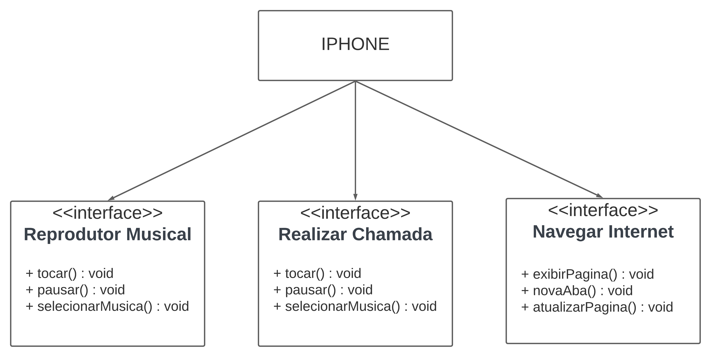

Autores

    João Paulo

** Comportamentos esperados:

  Aparelho Telefônico: fazer chamada, receber chamada, encerrar chamada, enviar mensagem e receber mensagem;
  Reprodutor Musical: tocar música, ajustar volume, pausar música e parar música;
  Navegador na Internet: abrir navegador, navegar para (site), realizar pesquisa (termo), visualizar pagina (site), fechar navegador;
  
Modelagem e diagramação da representação em UML:

